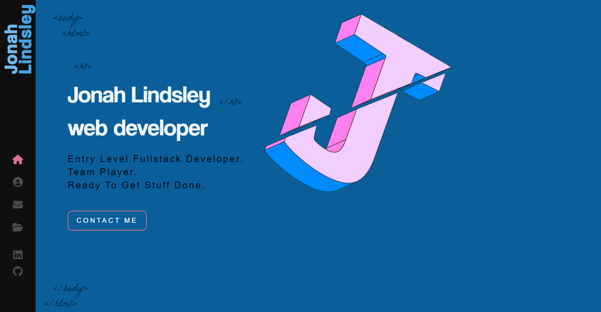

  # Jonahs portfolio  
  ***
  ## Discription 
  
  This is my personal portfolio website, I made it using react, sass, and Javascript. It features sections about me, my work and all the ways to get in contact with me (also bunch of css animations just for fun)   
  
  ***
  ## table of contents
  * [licence](#licence)
  * [installation](#installation)
  * [usage](#usage)
  * [contributors](#contributors)
  * [tests](#tests)
  * [questions](#questions)
  ***
  ## the deployed website  
  [click to view deployed website](https://jonahlindsley.github.io/Jonahs-portfolio)
  ***
  ## licence 
   
    1. Software can be modified, used commercially, and distributed.
    2. Software can be modified and used in private.
    3. A license and copyright notice must be included in the software.
    4. Software authors provide no warranty with the software and are not liable for anything.
  ## installation
  no need to install just visit the site  
  ***
  ## usage
  just follow the provided link  
  ***
  ## tests
  these are the test you should run to ensure optimum proformance: no tests needed  
  ***
  ## contributors 
  Jonah Lindsley  
  ***
  ## questions 
  please reach out to me via email at jonahlindsley@yahoo.com or [github](https://github.com/jonahlindsley) and i will get back to you 
